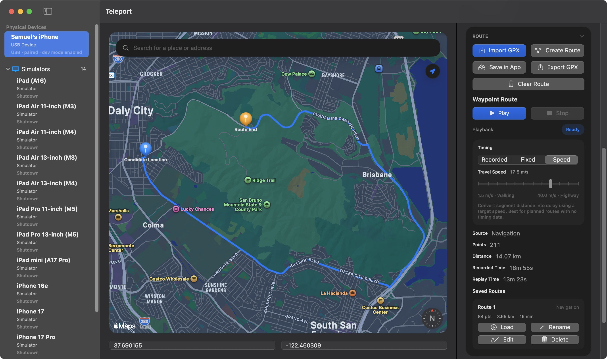

# Teleport

[English](README.md) | [简体中文](README.zh-CN.md)

Teleport is a native macOS app for faking iOS device location — on simulators and physical devices connected over USB or Wi-Fi.

It's built with SwiftUI and MapKit. Click somewhere on the map, hit Simulate, and your device thinks it's there.




## What It Does

**Full device support** — works with iOS Simulators and real iPhones over USB or Wi-Fi, all from the same app.

**Virtual joystick** — move the simulated location around in real time without picking a new point every time. Good for testing location-aware interactions on the fly.

**Custom routes** — draw a straight-line path between any stops, or use Apple Maps navigation to snap the route to real roads. Both can be played back at fixed intervals, or a target travel speed. Save/load/edit routes are fully supported.

**GPX import and export** — bring in existing routes or save yours out for use elsewhere.

A few other things:

- Click anywhere on the map, search by name, or type in coordinates to set a location
- Save routes inside the app and reload, rename, edit, or duplicate them later
- Session controls show clear status and let you stop or reset at any point

## Disclaimer

Teleport is meant for developer testing and debugging. Using it for anything else is on you — the app and its developer aren't responsible for whatever happens.

## Requirements

- macOS
- Xcode installed and opened at least once (so `xcrun`, `simctl`, and `devicectl` are on your path)
- For physical devices: Developer Mode enabled on the iPhone, plus `python3` and `pymobiledevice3`
- For Wi-Fi: pair over USB first, then keep the device unlocked on the same network

If macOS says developer tools are missing:

```sh
xcode-select --install
```

If `xcrun` is pointing at the wrong Xcode install:

```sh
sudo xcode-select -s /Applications/Xcode.app/Contents/Developer
```

Then open Xcode once to let it finish setup.

Install the Python dependency with whichever `python3` your shell resolves:

```sh
python3 -m pip install pymobiledevice3
```

## Getting Started

### Download

Grab the latest `.dmg` from the [Releases](https://github.com/samuelhe52/Teleport/releases) page, drag `Teleport.app` to Applications, and launch it.

### Run in Xcode

1. Open `Teleport.xcodeproj`.
2. Select the `Teleport` scheme.
3. Build and run.

### Build from the command line

```sh
xcodebuild -project Teleport.xcodeproj -scheme Teleport -destination 'platform=macOS' build
```

## Basic Usage

1. Launch Teleport and select a device.
2. Connect to it.
3. Pick a location — click the map, search, or enter coordinates.
4. Hit `Simulate`. That's it.
5. Build a route if you need to simulate movement.
6. Save routes for later, or import/export GPX files.
7. Hit `Stop` when you're done.

For physical devices, Teleport might ask for admin approval on first run, walk you through a missing Python dependency, or need a USB connection before Wi-Fi discovery kicks in.

## Development

- `make format` runs `swift format -r -p -i .`
- `make lint` runs `swift format lint -r -p .`

## Notes

Teleport was originally called iOSAnywhere.

If you're in mainland China, Apple Maps search tends to only return locations inside China. Searching for overseas places usually needs a VPN. You can still pan the map to anywhere and pick a spot manually.
