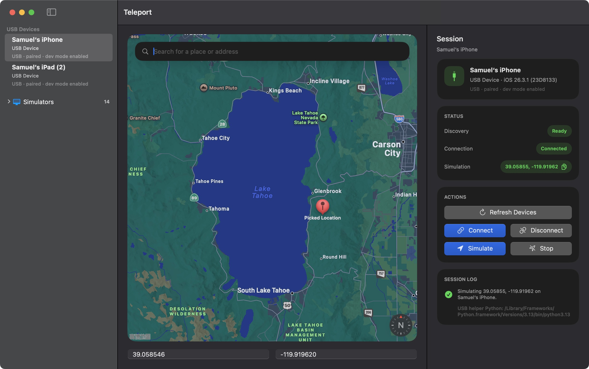

# Teleport

[English](README.md) | [简体中文](README.zh-CN.md)

Teleport 是一款原生 macOS 应用，用于在 iOS 模拟器和通过 USB 或 Wi-Fi 连接的实体 iOS 设备上模拟定位。

它基于 SwiftUI 和 MapKit 构建，提供桌面端工作流：在地图上选点、搜索地点，并将该位置推送到测试目标设备。



## 免责声明

Teleport 仅面向开发测试、调试以及其他正当的开发工作流而设计和提供。不建议将其用于上述范围之外的用途。

如果你将本项目用于非开发目的或其他非预期用途，相关风险需由你自行承担。对于因此产生的任何后果、责任或损失，本应用及其开发者概不负责。

## 功能

- 原生 macOS 三栏界面，分别用于设备选择、地图操作和会话控制
- 支持 iOS 模拟器的设置定位与清除定位流程
- 支持通过 USB 和 Wi-Fi 连接的实体设备定位模拟
- 提供稳定的模拟器和真机定位模拟流程
- 支持在地图上选点，并手动输入经纬度
- 支持 Apple 地图搜索和最近搜索记录
- 提供清晰的会话状态显示，以及停止与重置操作

## 环境要求

- macOS
- 已安装 Xcode，并至少启动过一次，使 `xcrun`、`simctl` 和 `devicectl` 可用
- 真机调试需要：通过 USB 或 Wi-Fi 连接的实体 iOS 设备，且已开启开发者模式
- 真机调试需要：`python3` 和 `pymobiledevice3`
- Wi-Fi 真机调试需要：先通过 USB 连接一次以建立配对记录，然后保持设备解锁并与 Mac 处于同一本地网络

如果 macOS 提示缺少开发者工具，请先安装 Apple 的命令行开发者工具：

```sh
xcode-select --install
```

如果已经安装完整 Xcode，但 `xcrun` 仍然指向错误的开发者目录，请显式切换：

```sh
sudo xcode-select -s /Applications/Xcode.app/Contents/Developer
```

然后启动一次 Xcode，完成模拟器和真机工具链的首次初始化。

将 Python 依赖安装到 Teleport 从当前 shell 解析到的同一个 `python3` 解释器中：

```sh
python3 -m pip install pymobiledevice3
```

## 快速开始

### 下载已构建的应用

如果你不想自行构建 Teleport，可以从 [Releases](https://github.com/samuelhe52/Teleport/releases) 页面下载最新的 `.dmg`。

打开磁盘映像后，将 `Teleport.app` 拖入 `Applications`，然后从应用程序文件夹启动。

### 在 Xcode 中运行

1. 打开 `Teleport.xcodeproj`。
2. 选择 `Teleport` scheme。
3. 构建并运行应用。

### 从命令行构建

```sh
xcodebuild -project Teleport.xcodeproj -scheme Teleport -destination 'platform=macOS' build
```

## 使用方式

1. 启动 Teleport。
2. 选择一个模拟器或实体 iOS 设备。
3. 连接设备。
4. 通过地图、搜索或手动输入坐标选择位置。
5. 点击 `Simulate` 应用该位置。
6. 点击 `Stop` 清除模拟位置。

对于真机，Teleport 可能会请求管理员授权；如果缺少必需的 Python 依赖，应用也会给出提示；而 Wi-Fi 发现通常需要先完成一次初始 USB 配对。

## 当前状态

Teleport 已经覆盖模拟器以及通过 USB 或 Wi-Fi 连接的真机设备的核心定位模拟流程。轨迹回放、GPX 导入和移动轨迹工具目前尚未包含在应用中。

## 开发

- `make format` 会执行 `swift format -r -p -i .`
- `make lint` 会执行 `swift format lint -r -p .`

## 说明

Teleport 最初以 iOSAnywhere 为名开发，后续更名为 Teleport。

如果你在中国大陆使用 Teleport，Apple 地图搜索结果可能仅限中国境内地点，或者无法返回海外地点。实际使用中，搜索海外地点可能需要 VPN。即便搜索不可用，你仍然可以直接拖动地图到其他区域并手动选择位置。

## 更新日志

发布说明见 [CHANGELOG.md](CHANGELOG.md)，其中包括 [v0.2.0](CHANGELOG.md#v020---2026-03-09)。
